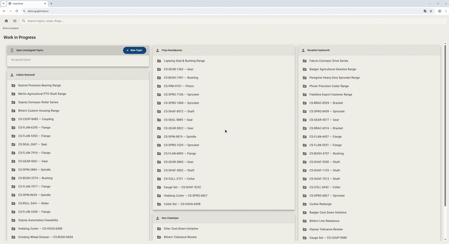

# Chrome Recorder



Record your clicks, typing and **timing** in Chrome, then replay them with [Puppeteer](https://pptr.dev) at the same pace.

Chrome's built-in DevTools Recorder can export Puppeteer scripts, but it throws away the time between your actions. This extension keeps it, and it keeps recording across page loads.

```
 Chrome extension                  player.js
┌──────────────────┐  recording  ┌──────────────────────┐
│ click, type,     │───────────▶│ reads recording.json  │
│ navigate + time  │    .json    │ replays it in Chrome  │
└──────────────────┘             │ with the same pacing  │
                                 └──────────────────────┘
```

## Quick start

**1. Get the code**

```bash
git clone https://github.com/jsteffensen/chrome-recorder
cd chrome-recorder
```

**2. Install the extension**

1. Open `chrome://extensions` and turn on **Developer mode**.
2. Click **Load unpacked** and select the `extension` folder (the one that contains `manifest.json`).

**3. Record**

1. Open the page you want to automate and **reload it once**, so the recorder can attach to it.
2. Click the extension icon, then **Start recording this tab**. A red `REC` badge appears.
3. Use the site normally, including actions that load new pages.
4. Click the icon again, then **Stop & download**. This saves a file named like `recording_demo.graphnote.io_20 Sep 2026 - 1435.json` (see [Recording file name](#recording-file-name)).

**4. Replay**

```bash
npm i puppeteer
node player.js "recording_demo.graphnote.io_20 Sep 2026 - 1435.json"
```

Use quotes around the file name, because it contains spaces. In the rest of this README, `recording.json` stands for your recording file. Requires Node.js 18 or newer.

## Replaying: what `player.js` does

```
node player.js <recording.json>
```

1. Finds a Chrome to use (see [Which Chrome is used](#which-chrome-is-used)) and opens it, with its window sized so the page area matches the size it had when you recorded (see [Window size](#window-size)).
2. Opens the first recorded page and waits. When it says `Page loaded. Press any key to start the replay...`, get the page into the state you want (for example, log in by hand if needed), then press a key in the terminal. `Ctrl+C` cancels.
3. Runs 200 ms after your key press, then repeats every recorded action with the original pauses.
4. **Shows what it is doing**, so the replay looks like a screen recording:
   - A **virtual cursor** (an arrow) sits on the page. It stays where the last click happened, and starts gliding to the next click 1000 ms before it (less if the pause is shorter, and scaled by `SPEED`). Before the first click it starts in the middle of the window.
   - Every click draws an **amber circle** that grows from nothing to 75 px and fades out over 500 ms.
5. **Leaves the browser open** when it finishes, so you can look at the result. Close the window or press `Ctrl+C` to exit. If a step fails, the browser also stays open so you can see where it stopped.

Each step is printed as it runs, for example `[2/4] fill "#urgent" (after 1225 ms)`.

### Options

There are no command-line options besides the recording file. These environment variables are supported:

| Variable | Effect |
| --- | --- |
| `SPEED=2` | Replay at twice the recorded speed (`0.5` = half speed). The 200 ms start delay is not affected. |
| `PASSWORD=...` | Text typed into password fields (see [Privacy](#privacy)) |
| `WINDOW_SIZE=off` | Don't resize the window to the recorded size; open it maximized instead |
| `VIRTUAL_CURSOR=off` | Don't show the gliding mouse cursor |
| `CLICK_INDICATOR=off` | Don't draw the amber circle at each click |
| `PUPPETEER_EXECUTABLE_PATH=...` | Use this exact Chrome |
| `PUPPETEER_CACHE_DIR=...` | Look for Puppeteer's downloaded Chrome here instead of `~/.cache/puppeteer` |

Set them for one run like this:

```bash
# Windows (cmd)
set SPEED=2
node player.js recording.json

# Windows (PowerShell)
$env:SPEED = "2"
node player.js recording.json

# macOS / Linux
SPEED=2 node player.js recording.json
```

## Which Chrome is used

Puppeteer normally insists on one specific Chrome version and stops with `Could not find Chrome (ver. ...)` if that version isn't installed. `player.js` looks for a Chrome that is already on your machine instead, and uses the first one it finds. It prints the choice, for example:

```
Using Chrome: C:\Users\you\.cache\puppeteer\chrome\win64-150.0.7871.24\chrome-win64\chrome.exe
```

The search order is:

1. **`PUPPETEER_EXECUTABLE_PATH`**, if you set it.
2. **The version Puppeteer expects**, if it is installed.
3. **Any Chrome in Puppeteer's cache**, newest version first. On Windows the cache is `C:\Users\<you>\.cache\puppeteer\chrome\win64-<version>\chrome-win64\chrome.exe`; on macOS and Linux it is `~/.cache/puppeteer/chrome/...`. `PUPPETEER_CACHE_DIR` changes the location.
4. **A regular Chrome or Chromium install:**
   - Windows: `chrome.exe` under `%LOCALAPPDATA%`, `%ProgramFiles%` or `%ProgramFiles(x86)%`, in `Google\Chrome\Application`
   - macOS: `/Applications/Google Chrome.app`
   - Linux: `/usr/bin/google-chrome`, `google-chrome-stable`, `chromium` or `chromium-browser`

A cached Chrome is preferred over an installed one, even if the installed one is newer. To force a specific browser, set `PUPPETEER_EXECUTABLE_PATH`:

```
set PUPPETEER_EXECUTABLE_PATH=C:\Program Files\Google\Chrome\Application\chrome.exe
```

If nothing is found, the player tells you to run `npx puppeteer browsers install chrome` or to set `PUPPETEER_EXECUTABLE_PATH`.

## Recording file name

Recordings are saved as `recording_<site>_<DD Mmm YYYY - HHMM>.json`:

- `<site>` is the host of the first page you recorded, without the path (`https://demo.graphnote.io/topics/1` gives `demo.graphnote.io`). A port is kept and joined with a dash, so `http://localhost:3000/app` gives `localhost-3000`.
- The date and time are when the recording **started**, in your local time, for example `20 Sep 2026 - 1435`.

## What gets recorded

| Action | What is saved |
| --- | --- |
| Click | Several selectors for the element (see below). Recorded when the mouse button is pressed, so it also works for dropdown lists and menus that react to the press and disappear before the button is released |
| Typing in a text field | The final value, plus how long you took to type it |
| Dropdown (`<select>`) | The chosen value |
| Enter, Tab, Escape, arrow keys | The key |
| Page load | The URL and when the page finished loading |
| Window size | The size of the page area, at the start and at every page load |

Every event carries a millisecond timestamp.

**Selectors.** Each clicked element is saved with a list of ways to find it, best first:

1. a unique, stable `id` (ids that a framework makes up at runtime, such as `mat-mdc-chip-0` or `cdk-overlay-3`, are ignored),
2. a unique `data-testid` / `data-test` / `data-cy` / `data-qa` / `formcontrolname` / `name` / `aria-label` / `placeholder` / `title` / `alt` attribute,
3. for buttons and links with a label (up to 200 characters) that is unique on the page: the label text,
4. a full CSS path as the last resort.

The player tries them in order until one matches a visible element, and waits up to 10 seconds for it to appear.

## Angular Material

Angular Material lists and chips can show up in a different order every time, and their ids are made up at runtime, so a position-based selector ("the 3rd chip") replays the wrong element. For these components the recorder saves the element's **text** instead:

| Component | Found again by |
| --- | --- |
| Chips (`mat-chip`, `mat-chip-row`, `mat-chip-option`) | the chip's label, e.g. `#review-needed` |
| Chip remove button (the x) | the remove button inside the chip with that label |
| Select and autocomplete options (`mat-option`) | the option's text |
| Menu items (`mat-menu-item`) | the item's text |
| Tabs (`role="tab"`) | the tab's text |
| List and nav-list items (`mat-list-item`) | the item's text |

Icon names such as `cancel` or `delete` (Material icon ligatures) and `aria-hidden` parts are ignored when reading the text. If two visible elements have exactly the same text, the recording also stores which one it was.

There is deliberately **no position-based fallback** for these components. If the chip or item you clicked no longer exists, the replay stops with `Element not found` and shows the text it was looking for, instead of clicking a different item.

In `recording.json` a text-based selector is an object next to the normal CSS strings, and you can edit it by hand:

```json
{ "css": ".mdc-evolution-chip__text-label", "text": "#review-needed" }
{ "css": "[matchipremove]", "in": { "css": ".mat-mdc-chip", "text": "#review-needed" } }
```

Other Material components (date pickers, sliders, autocomplete typing, drag and drop) get the normal treatment described above.

## Window size

Sites lay themselves out differently depending on how big the window is, so the recorder notes the size of the **page area** (the part of the window that shows the page, in CSS pixels, excluding tabs, address bar and bookmarks bar) when you start recording and again at every page load.

The player opens Chrome maximized, then resizes the window until the page area matches exactly. It measures the page area itself, so it works even if your recording machine and your replay machine have different amounts of browser chrome (a bookmarks bar, a taller title bar, a different operating system). The first size is applied before the "press any key" prompt, so you can see it. If you resized the window while recording, the player resizes at the same page load.

- A window can't be bigger than the screen. If the recorded size doesn't fit, the player prints `Could not make the page area ... x ...` and carries on with the biggest window it can get. It never asks for more than the screen has, and always places the window at the top left so it stays on screen.
- If Chrome refuses to resize, the player prints `Could not resize the window: ...` and carries on with the maximized window.
- DevTools docked to the side or bottom of the window takes space from the page area. If it was open while you recorded, the recorded page area is the smaller size left over, and the replay window gets that smaller page area too.
- Browser zoom is not recorded. The size is measured in CSS pixels, so a page zoomed to 110% while recording is replayed at 100% with the same number of CSS pixels, which lays out the same but looks smaller.
- Recordings made before this feature have no window size, so they open maximized like before.

## How timing works

The player turns the gaps between your recorded actions into pauses:

- Between two actions on the same page, it waits as long as you did.
- If an action loaded a new page, the player waits for the load, and your pause is measured from when the page **finished loading**. Slow page loads therefore aren't added on top of your original pacing.
- Typing is replayed one character at a time, spread over the time you originally took.
- The very first action is the exception: the recorded pause before it is replaced by the fixed 200 ms after your key press, because that recorded time no longer means anything.

## Optional: generate a standalone script

If you'd rather have a plain Puppeteer script you can read and edit, `convert.mjs` turns a recording into one:

```bash
node convert.mjs recording.json replay.mjs
node replay.mjs
```

The generated script has the same pacing and sets the recorded page size, but it is simpler than `player.js`: it launches Puppeteer's default Chrome (it does not search for other installs), does not wait for a key press, and closes the browser when it finishes.

## Works with

- `http://` and `https://` sites, including `localhost` and other local or LAN addresses.
- Sites with a self-signed certificate: add `acceptInsecureCerts: true` to the `puppeteer.launch(...)` call in `player.js`.
- `file://` pages: enable **Allow access to file URLs** in the extension's details page.

The replay starts a fresh Chrome profile, so it has no cookies or login. That is what the key press is for: log in by hand while the player waits, or record the login steps too.

## Privacy

- Everything stays on your machine. The extension makes no network requests.
- The recording is kept in the extension's local storage until you start a new one, and is written to disk only when you click download.
- **Password fields are never recorded.** The recording contains a placeholder, and the player reads the real value from the `PASSWORD` environment variable.
- **Other typed text is saved in plain text** in `recording.json`. Don't share recordings that contain anything sensitive.
- The content script is loaded on every page (`<all_urls>`) so it can start recording after a page load, but it only listens and reports events for the one tab you chose to record.

## Limitations

- One tab and top-level frame only. Popups, new tabs, iframes and shadow DOM are not recorded.
- Not recorded: scrolling, hover-only menus, drag and drop, file uploads, right clicks, keyboard shortcuts and the back/forward buttons.
- Route changes in single-page apps aren't logged as page loads. The player simply waits for the next element to appear, which usually works.
- Selectors can break on sites that generate ids or class names on every build, or on lists whose items have no distinguishing attribute or text (the fallback is then a position such as `a:nth-of-type(20)`). Edit the `selectors` list of that step in `recording.json` if a step can't find its element.
- A dev server that does a full reload while you record adds a page load that no click caused, and the player will reload the page at that point. Remove that `navigate` entry (and the `loaded` entry after it) from `recording.json`.
- If you drive a page load with the keyboard, the recorder saves the Enter key, and the player waits for the load.

## Troubleshooting

| Problem | Fix |
| --- | --- |
| `Could not find Chrome` | Run `npx puppeteer browsers install chrome`, or set `PUPPETEER_EXECUTABLE_PATH` to a `chrome.exe`. |
| "Failed to load extension: Manifest file is missing" | Select the `extension` folder, not the repository folder. |
| "Could not attach to this page" | Reload the page and start again. `chrome://` pages and the Chrome Web Store can't be recorded. |
| The browser window doesn't show up, or only a small Chrome popup (such as the translate bar) is visible | Run with `WINDOW_SIZE=off` (`set WINDOW_SIZE=off` in cmd) to skip the resizing. Please report the `Window:` line the player prints, it shows the size and position it gave the window. |
| `Element not found: ...` during replay | The page changed or the selector is unstable. Edit that step's `selectors` in `recording.json`. |
| Recording has fewer events than expected | Make sure you reloaded the page after installing or reloading the extension, and that the actions happened in the recorded tab. |
| Replay is slower than the recording | The player also waits for elements and page loads. Use `SPEED=1.5` to compensate. |

## Project layout

```
extension/
  manifest.json    Manifest V3 configuration
  content.js       Records clicks, typing, keys, URLs and timestamps in the page
  selector-engine.js  Text-based selectors (Angular Material); shared by the extension and player.js
  background.js    Service worker that stores the recording state and events
  popup.html/js    Start / stop / download buttons
player.js          Replays a recording with Puppeteer (needs extension/selector-engine.js, so keep the repository together)
convert.mjs        Optional: turns a recording into a standalone Puppeteer script
```

## Contributing

Issues and pull requests are welcome. Ideas for future versions: scroll and hover recording, iframe support, multiple tabs, and `@puppeteer/replay` JSON output.
